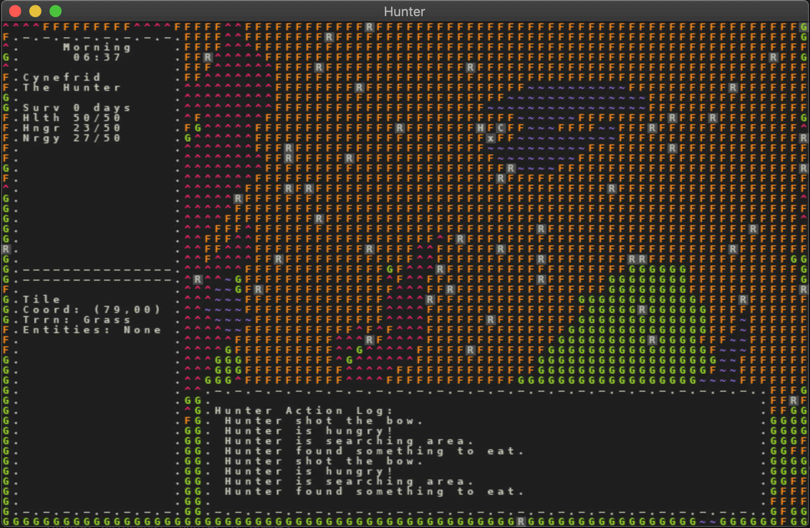

# Hunter
## Summary
This is a simple project to explore the idea of simulating a hunter trying to survive in his/her environment, and the development of all the systems necessary to accomplish that.

Currently, the gameplay is represented by ASCII characters rendered in a small console window. There is an H, the Hunter, that moves around and attempts to survive. The Hunter's vital stats are displayed on the left and the Hunter's action log is displayed at the bottom. When hungry, the Hunter will search for berries to eat or rabbits to hunt (the R's), and when tired, the Hunter will return to camp (C) to sleep.

There are two player controls right now:
- **F** - toggle fog of war
- **H** - toggle user interface

And that's it! This is not a game for playing so much as observing (like an ant farm). From this humble start, I hope to build a rich world that is genuinely enjoyable to observe. And eventually I do plan to add more ways for the player to interact with the world. But for now, you'll have to use your imagination. :)

If you really want to tinker, you can modify the stats in [this file](https://github.com/trevordbabcock/hunter/blob/master/hunter_pkg/config/stats.json). For example, in the "rabbit" section try changing "spawn" to 0.2 and see what happens. User beware: there are tons of ways to break the game messing with this file! 

<br/>

<br/><br/>

For more info, see blog entries in the [blog directory](https://github.com/trevordbabcock/hunter.git). There, you can read about my progress, process, goals for the future, and general ruminations. [This post](https://github.com/trevordbabcock/hunter/blob/master/blog/2020.09.26.CREATURES.ECOSYSTEMS.md), where I organized my thoughts on how to simulate creatures of varying complexity, may be a particularly interesting starting point.

## Installation
### Using Python Eggs
Install pyenv. For MacOSX, run the following:
```
> brew install pyenv
```
Note: some other setup steps may be necessary.


Using pyenv, install Python 3.8 or higher:
```
> pyenv install 3.8.0
```

Install the Hunter egg:
```
> pip install hunter-tdb==0.8.0
```

Run the game!
```
> run hunter
```

### Running from source
Install python 3.8 or higher:
```
However you like. :)
```

Clone source:
```
git clone https://github.com/trevordbabcock/hunter.git
```

Install requirements:
```
cd hunter
pip install -r requirements.txt
```

Run the game:
```
./hunter_pkg/main.py
```

## Roadmap
* **v0 - prototype hunter surviving in basic environment/ecosystem**
  * ~~**v0.1** - remove tutorial code, add color, allow larger map, collision~~
  * ~~**v0.2** - add realtime game loop, add rabbits, add event queue~~
  * ~~**v0.3** - add berry bushes, add hunter eating berries, improve rabbit behavior~~
  * ~~**v0.4** - add first ui elements, add hunter hunger system and death, fix tech debt~~
  * ~~**v0.5** - add day/night cycle, add hunter action log, add fog of war, add tile examination~~
  * ~~**v0.6** - add hunter sleep, add hunter camp, track hunter stats, fog of war toggle,add hunter bow and arrow, add rabbit hunting~~
  * ~~**v0.7** - revise hunger/health/energy system, improve rabbit behavior, improve hunter ai~~
  * **v0.8** - include procedural map generation, increase map size, improve game balance
  * **v0.9** - add wolves
* **v1 - improve ecosystem**
  * **v1.1** - add another creature 1
  * **v1.2** - add another creature 2
  * **v1.3** - add point of interest 1
  * **v1.4** - add point of interest 2
* **v2 - prototype map size scaling**  
* **v3 - prototype map size scaling**
  * **v3.1** - add save functionality
  * **v3.2**

* **v4 - improve graphics?**
