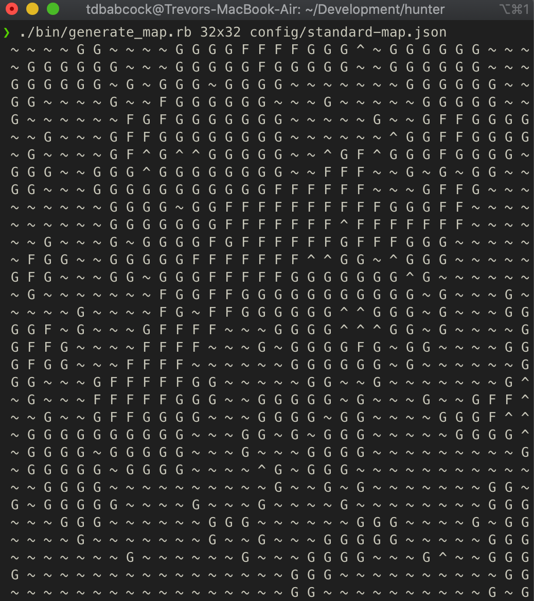
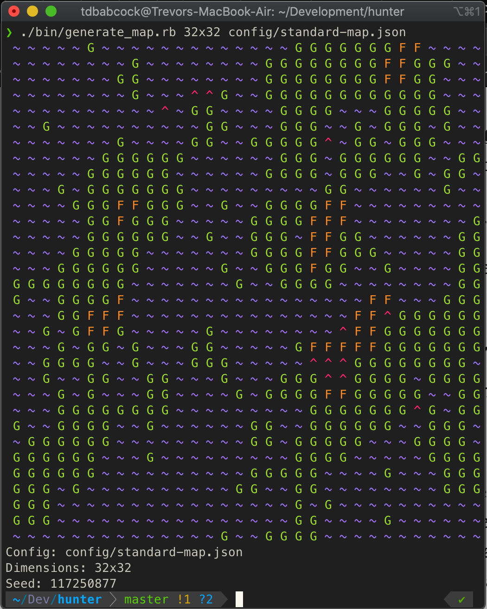
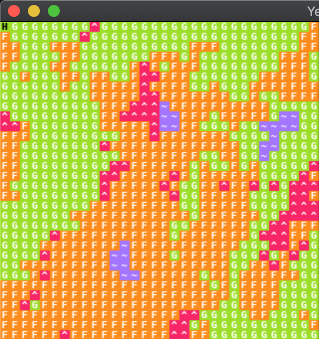
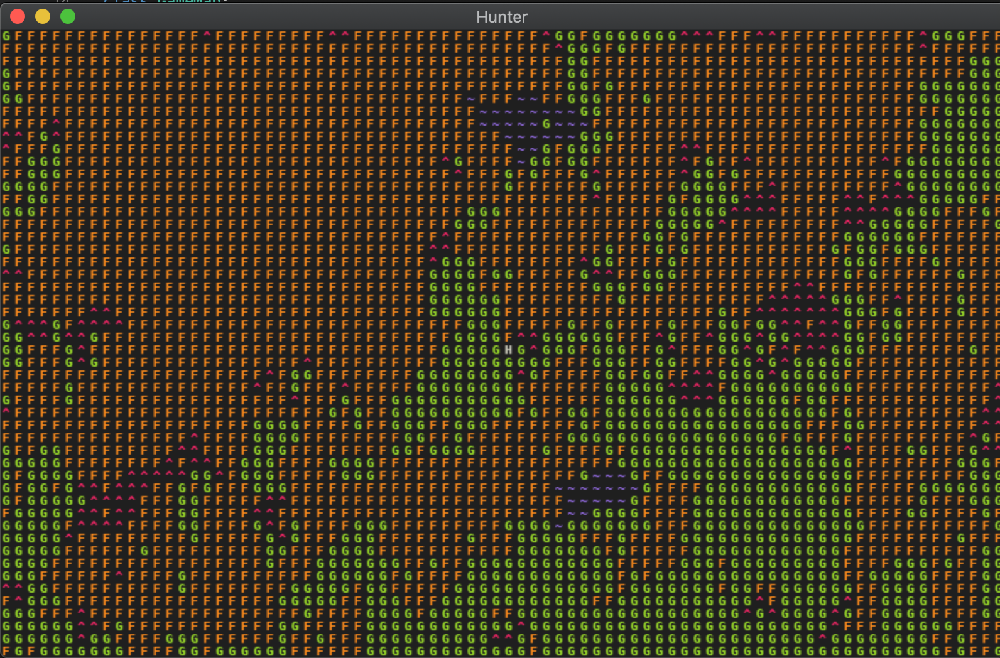

# July 27 2020
## Progress
POC v1, which I outlined in my last blog post, is finished! After a significant refactor of the code to simplify things, I was able to make progress pretty quickly. Here are a few screenshots from various versions of the procedural map generator and the hunter game itself:

Early map generator output:
 

  
Later version of map generator output:
 

  
Initial in-game view of map:
 

  
Current in-game view of map:
 

In the last image, you can (barely) see a white H in roughly the center of the map. This is the Hunter. In this version of the game, the player is able to move the Hunter around using the arrow keys, and the Hunter is able to move on land and forest tiles, but not on water or mountain tiles.

This achieves all of my goals for POC v1. But there's still a loooong way to go.

## Proof of concept v2
One of the first things on my mind right now is that the main game loop is still turn-based. For there to be a world "living" from moment-to-moment, the game will need a real-time loop. This is at the top of my list for v2.

After that, I think a good next step would be to add rabbits to the world. The first simulated entity! Adding rabbits will force me to get several systems in place relating to entity management, such as entity configuration, spawning, artificial intelligence, and movement. For most of these I will be able to borrow from the tutorial at least to some extent.

I've also been thinking about what scale to make the map relative to the Hunter. How large is one tile? Five feet? Five hundred? And what implications will different sizes have on the underlying simulation e.g. how many rabbits can you pack into one tile? How close do entities need to be to each other in order to interact?

If I can accomplish all of the above, then I'll have a pretty strong POC v2. And in v3, perhaps I could start adding Hunter AI and survival elements!

Welp, see you later.