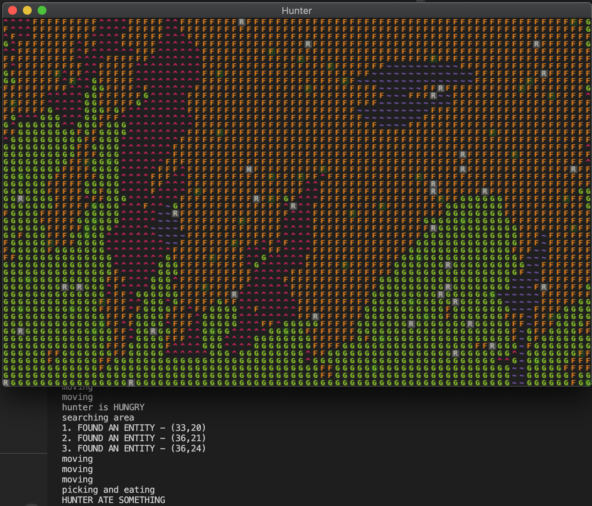
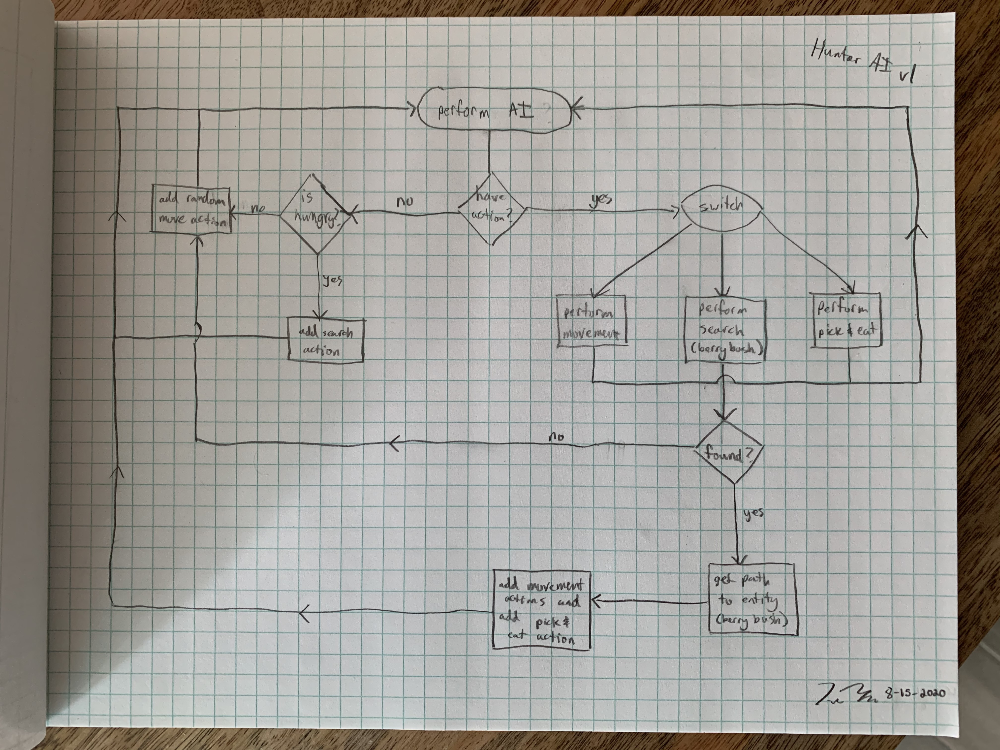

# August 17 2020
## Progress
Oh lawd, I finally pushed the code to improve the hunter AI, enabling them to find and eat berries. This turned out to be way more work than I expected, though it was naive of me to underestimate it. This marks the completion of (what I'm now calling) POC v0.3.

My tasks for POCv0.3 were to add more rabbits, add collision with terrain, add berry bushes with berries that regrow, and add hunter AI allowing them to find a berry bush, path to it, then pick and eat a berry. When I set these goals, I knew the berry bush and hunter AI implementation would be tougher, but I didn't realize how much more challenging they would really be. I knocked out the tasks relating to rabbits pretty quickly, then started on berry bush implemenation. I got bogged down in that when I realized I needed to do a significant refactor (which I've already written about). Then I started on the hunter AI, which turned out to be a doozy.

Here's a shot of what this version looks like:

The white H is the hunter, the white R's are rabbits, and the text at the bottom is some debug logging that tracks the hunter's behavior. There are also some terrain tiles that have a dark green background. This indicates that the tile contains a berry bush.

Much of the challenge of implementing the hunter AI stemmed from figuring out where to put things such that they could have access to the information they needed, but not have access to too much information. I made many tweaks in this area, though I don't remember many of the details off-hand. I had a few issues with circular dependencies, which I was able to solve by structuring my code a little better.

I added the ability for the hunter to search an area for an entity of a certain type. I also added the ability to path to an entity that the hunter found. This turned out to not be too difficult since I was able to plug in the pathfinding logic from the tcod library.

One of the bigger tasks I struggled with was how to implement the structure of the AI. Not what the AI would actually do, but how the AI would run from iteration to iteration, maintain state properly, and have access to things it needed to know about. As I've discussed before, the game engine has an event queue to which many types of events are appended, such as berry-growth events, rabbit-AI events, and hunter-AI events. So every iteration of the game loop, the engine checks to see if the hunter AI should be "performed". But the issue is that the hunter AI itself needs state. For example, the hunter needs to be able to decide to go to a spot on the map, look for something, then take a specific action based on whether or not they found what they're looing for. This is not an atomic action, it is a series of actions, and they would take many iterations of the game loop to execute. So how can I enable this sort of behavior?

I settled on a system that uses an action queue internal to the hunter AI. The basic idea is that when the hunter AI is performed, we check if the hunter has any actions in the queue, and if so, take the first action and perform that. If not, use a heuristic to select a reasonable next action, and append one or more actions to the queue.

If you want to know more in detail, here's a decision tree I drew to visualize the behavior:

I struggled a bit with how to queue up a series of actions, and especially with how to chain actions together appropriately based on conditionals. It was a little hard for me to figure out where, when, and how to chain some of the actions because the places that felt natural didn't have access to the information that I needed. And in some cases, giving those places access to the needed information felt wrong. I know this is vague, but it's difficult to remember a lot of the details since I was addressing problem after problem for six days straight.

I've just had the realization that I may have unwittingly implemented a reasonable chunk of a game engine. Not exacty what I set out to do, but the process has been extremely interesting and I've learned a tremendous amount.

There have been several moments where I stopped and thought to myself, "My day job seems easy compared to this." I think that mostly has to do with how new I am to game development, and how fresh the problems seem. We'll see if I keep feeling that way.

## Proof of concept v0.3 and beyond
So that's that for POC v0.3. In my previous blog post, I mentioned that I felt I was close to POC v1.0. Now that I've finished this last POC phase, I no longer feel like I'm at v1.0. At the very least, I think the hunter needs to be able to die for me to consider it v1.0. So I've still got a ways to go there. Perhaps I should think in detail about what I'd like to see in v1.0, then work backwards from there to plan out one or more POC versions that will get me there.

I have noticed that as the game increases in complexity, it becomes harder and harder to figure what is happening under the hood, and why, when I'm debugging. I definitely need to spend some time giving myself introspection tools, otherwise I will imminently become exceedingly sad. I'm currently planning to devote a whole POC to adding such tools. 

So yeah, I think I will try to figure out what POCv1.0 should look like, and work backwards from there. I'll write another post soon about what my next goals will be.

Welp, see you later.
