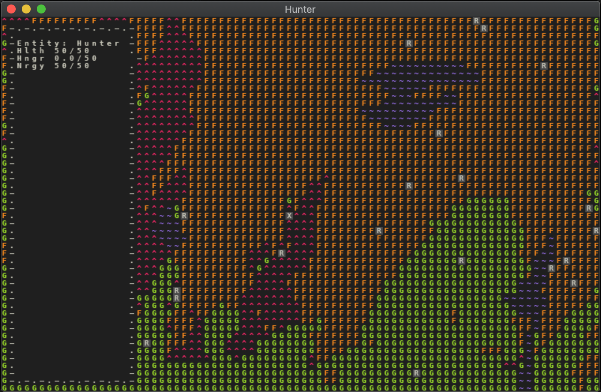

# August 26 2020
## Progress
Today marks the first time the hunter died. This is a screenshot of their first death:

The X is the body of the dead hunter. They starved to death because I set the spawn rate of berry bushes to 0, so they had nothing to eat. :)

This is kind of a big moment. It's the first time the game has managed to achieve my original idea: to create a world in which a hunter can live (or die). Of course, the world is extremely primitive and the hunter's AI could use a lot of improvement, but this achievement means many (or most?) of the major components are in place. I'm now in a good position to make iterative improvements, to flesh the world out more.

## Art
I dwell a lot on the future of this project, the many places it could go, what I'm trying to build, and why I'm trying to build it.

From one perspective, I'm simplying building this world to build it. I'm building it for fun, to help me learn, and to give me a creative outlet. For many people, when they want to create a world, they start writing a book, build the world there, then create a story within that world. They create the world out of nothing, come up with locations, people, and events that define it, but they also come up with the rules of the world (such as what technology is available, how magic systems work, or whatever). When it comes down to it, though, it's purely up to the author to enforce the rules that they create for the world. And any event that occurs in this world must be thought up by the author.

I, too, am creating a world from nothing, adding inhabitants, and creating the rules of the world, but in my case it's not up to me to enforce the rules; instead, it's up to the computer. But while it's up to an author to create interesting things happening in the world they create, my hope is that if I do a good job setting up the rules of the world, interesting events will occur all on their own. And the "dream" is that new and unexpected behaviors will emerge from the interaction of the inhabitants of the world as governed by the rules of the world.

For example, if I were to set the rate of reproduction a little too high for rabbits while also not providing enough natural predators for them, I could end up with a world where every berry bush is getting picked clean by a gang of hungry rabbits. And if I were to make the rabbits aggressive when they're starving, the result, I hope, would at least be amusing.

My hope is that, as I develop my world, funny behaviors like this will emerge. And perhaps in some cases I'll "fix" them, but I may also leave them in. They might even end up being a source of inspiration, giving me ideas on how to make my world more interesting and unique.

I keep coming back to the idea that I am creating and ant farm: a little self-contained world that can go on existing without my input and without knowledge of me. There are more places I could go with this world than simply being an ant farm that I observe for my own amusement, but I'm not ready to discuss those ideas too deeply yet.

## Proof of concept v0.4
I kinda crushed POC v0.4. Overall it took about a week. I made a few changes to make things easier to develop and debug, like adding a better logging system. I also cleaned the code up a bit by moving entity stats to a config file e.g. hunter vision distance, berry nutritional value, etc.

I added my first UI element, a large panel that shows up on the left side of the screen and displays the hunter's vital stats, such as how hungry they are.

Finally, I extended the systems already in place to allow for the hunter's death by starvation. This required quite a few improvements to the hunter AI governing finding berry bushes and picking and eating berries.

The result is that the hunter is now able to check if they are hungry (based on a real stat; hunger increases slowly over time), and if they are, find a bush, path to it, and start eating berries until they are full enough or the berries run out. If the berries run out, they walk in a random direction and repeat the whole process, possibly finding more bushes and eating more berries.

There was a minor impediment in v0.4. Importing files is a bit weird in Python, which I only ran into when I started trying to write unit tests. Other than that, though, it went pretty smoothly.

My next three POC versions are already planned out, so there is no shortage of work, and no question of what to work on next.

Welp, see you later.