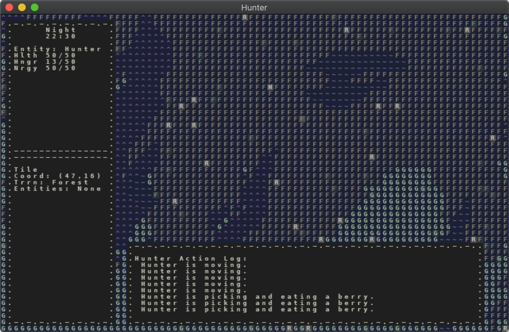

# September 6 2020
## Proof of Concept v0.5
I'm feeling very good about the fact that I finished POC v0.5 in exactly one week. For this version, I had several tasks relating primarily to the UI and game presentation: two for improving the UI, one for adding fog of war, and one adding a day/night cycle.

## Day/Night Cycle
Days are now divided into four different times-of-day: morning, afternoon, evening, and night. Each quadrant of the following image shows the color scheme for these times of day:
<br/>

<br/><br/>
I came up with a system for tracking the time that I think will work pretty well, and that can be easily adjusted as I tweak and balance the game.

The game loop is supposed to run 60 times every second (though I have good reason to believe it runs quite a bit slower than that; another topic entirely), so I came up with a time tracking system where I have a global number that I increment every iteration of the game loop. This number keeps getting higher until it reaches a certain threshold (24,000 right now), at which point it is reset to 0 and a new day has begun. The result is that each in-game day lasts around five minutes. This also means that I can arbitrarily divide up the 0-to-24000 range into different sections, and treat each of them as a different part of the day. Here's a visual representation of the sections of the day:
```
00 01 02 03 04 05 06 07 08 09 10 11 12 13 14 15 16 17 18 19 20 21 22 23
------------------||----------------||-------------||-------||---------
      night              morning        afternoon    evening    night
```
Right now there are four parts of the day, as I mentioned before, but I will probably add one or two more in the future to make the color transitions a little smoother. And while currently the time of day is purely cosmetic, I will soon add gameplay features that take the time of day into account, such as adjusting how far the hunter can see based on how dark it is.

I can easily tweak how long each part of the day lasts, and I can also adjust how long the overall day lasts (as a function of the FPS that game runs at). One downside to the system is that, due to a rounding issue, the "minutes" count up at a noticeably-uneven rate. There are a number of ways I could probably fix or hide that issue.

For now, I think this system will work very well.

## Improved UI
The most challenging tasks of POC v0.5 related to improving the UI. I added mouse support along with the ability to hover over a tile and see information about what's on that tile. Here are a couple of shots of what the UI looks like now:
<br/>

<br/>

<br/><br/>
You can mouse over a tile and see the tile coordinates (very nice for debugging!), the terrain type, and a list of entities that inhabit that tile. For berry bushes, you can even see how many berries are on the bush.

I also added the hunter action log, which simply logs all of the hunters activities and directives from moment to moment. While it only supports logging the hunter's actions right now, eventually it will be able to log the actions of any selected entity e.g. rabbits.

The hunter action log was the second UI window I added to the game, so it became clear while creating it that I had to signifcantly refactor my UI code to make supporting different types of window both possible and sane. While the UI code is quite a bit improved, it still has a long way to go.

## Fog of War
The map now defaults to being covered in "fog of war" that must be removed by exploring. As the hunter moves around the map, it naturally gets cleared out. I do not currently have a sort of "half-fog" that partially covers areas that have been explored but that are not currently in vision. I'll probably add that at some point in the future.
<br/>

<br/><br/>
There were only minor technical challenges in implementing the fog of war. Currently, the fog of war only applies to the hunter, but in the future I'll make it so that you can see the fog of war from the perspective of any living entity.

Interestingly, immediately after I finished implementing fog of war, I found that it really changed the feel of the game and the world in a way that I didn't particularly like. As a result, I decided to pull in one of the tasks I had scheduled in the next POC version: I added a hotkey that allows the player to disable fog of war.

## Seasons
Now before you get the wrong idea, I did not implement seasons in this POC version. Instead, working on the day/night cycle got me thinking about how cool adding season could be in the future. Not only would they affect the weather in certain ways at certain latitudes, but they could also affect the length of days and, of course, animal/creature behaviors.

## Art Show
In order to stay excited about this project, I have a to, from time to time, allow my self to indulge in grandiose visions of the future of this game. It helps keep my hype level high, and even if the visions are unlikely to come true, it's still fun to think about. And who knows? Maybe it will happen.

I had the idea of maybe, at some point in the (probably-distant) future, having an art show at a gallery featuring Hunter. Each art piece would be an LCD with a Raspberry Pi or some small piece of hardware that can run the game. The screen and hardware could potentially be framed in some way that looks cool, but wouldn't necessarily have to be.

Each piece would simply run the game. You could hang it on the wall and observe it, watching it slowly progress over time like an ant farm or a growing plant. There would be no real means of interacting with it and no controls; it would only be for watching.

There could be multiple pieces, where each one is a different version of the game, from very old versions to much more recent ones. Each piece could have a different randomly-generated world. The randomness could be seeded or unseeded.

I think it would be very cool to be able to hang something like this on the wall or display it on a shelf or night stand.

For the art show itself, I could show the pieces, but also do a demonstration of the tech I use for scaling the world up, which I think would be pretty fascinating.

There would definitely be logistical issues, like how to run a reasonably-sized world on a small enough piece of hardware, potential cost problems, and things like that. But it's fun to imagine it might happen, and think about how I might solve some of those problems.

## Upcoming POCs
I've snuck a few extra tasks that are pretty small into the next two POC versions. As I've continued working on the past couple versions, my vision for what I consider to be v1.0 has changed, albeit only slightly. So I've made a couple tweaks to the next two POC versions, and I'm considering adding a third one (to add procedural map generation) before I call it v1.0.

Welp, see you later.