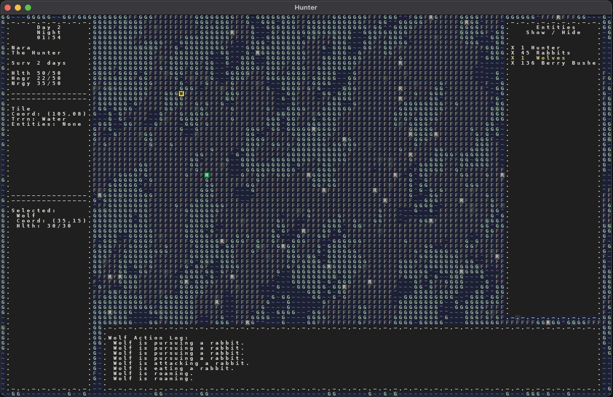
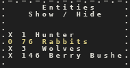
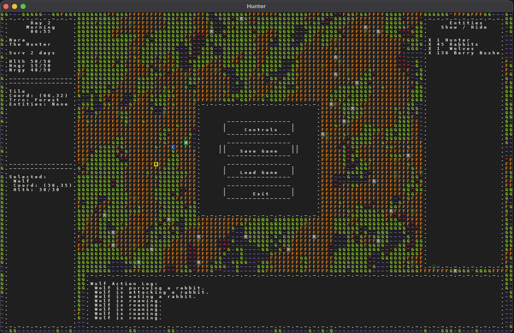
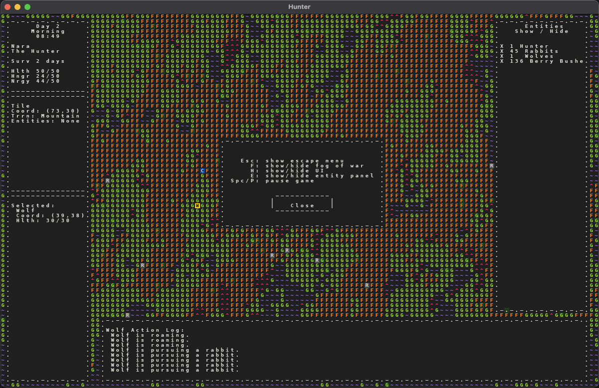

# April 21 2021
## Version 1.1 Complete
Good lord, v1.1 was WAY too big. I don't know why I felt compelled to cram so much stuff in there. Here's a final list of the stuff that was included:
- Escape menu
- Buttons (hoverable, clickable, with color change)
- Pausing the game
- Entity selection (with the mouse)
- Action log for all intelligent entities (when selected)
- Stats panel for selected entity
- Entity overview panel
- Ability to show/hide entities by type

I think that, after taking a hiatus from the project, I had completely lost my sense of how much work different tasks would be, and I also had no sense of how many tasks to put in a version. Even now, when I look at older versions in the roadmap, they were much, much smaller than v1.1 was. For example, for v1.0 I just have the text "add wolves, hunter vs wolf combat". Even if there was a bit more in that version, that's still modest compared to what I undertook for v1.1. In my last post I mentioned pulling some tasks out of this version, but even with those extra tasks pulled this version was still a TON of work. So that's a lesson learned, keep versions smaller and easier to deliver on, if only because it makes the mental game easier.

## UI
Virtually all the changes in this version related to the UI in some way. I both expanded on existing panels and features, and added completely new panels and features.

My original intent with this game is to create a simulation of a world, and make it more and more realistic by layering in more elements. For example, enhancing creature simulations to have more complex and realistic behaviors, adding more creatures to an ecosystem, adding more ecosystems, adding more realistic survival elements, enhancing hunter behavior to increase survivability, and so on. 

The work I completed for v1.1 doesn't get me directly closer to any of those things. However, for the game to be of interest to anyone (other than me), the player must be given ways to observe what's happening within the simulation. What's the point of creating a rich simulation if almost none of the richness is observable? So the UI work goes a long way towards increasing observability, which I think makes it worth it.

 

Above, you can see the addition of the entity overview panel on the right. On it, the 4 main types of entities are displayed with an X next to them. Each of these lines of text is clickable, and when clicked the X changes to and O to represent "off" (like a checkbox):

 

When an entity is toggled off, it is hidden from the map view. You may also notice the text turns yellow when hovered by the mouse (!!).

Eventually, I hope to have tons of entities being simulated at once, and, when I do, this feature will be extremely helpful.

You may also notice the bright yellow "W" in the upper left corner. This shows that the Wolf has been selected (by clicking). The selected entity becomes bright yellow, and the lower left panel shows stats for that entity. In addition, the action log displays recent actions for that entity.

 

When you press "escape", the above menu is displayed. It contains functioning buttons that have a hover state (extra bars seen around "Save Game" in this case), and each of the buttons is clickable. The "Exit" button closes the game, the "Save" and "Load" buttons don't do anything yet, and the "Controls" button displays the following window:

 

## Refactor
When I undertook this work, there was already a good deal of UI code, and a fair amount of it needed some refactoring. I added buttons, button hover states, and the entity overview panel all without needing to refactor very much. I did refactor the single large panel on the left into three separate panels, but that was about it...

Until I started trying to add a hover state to my "text only" buttons in the entity overview panel. In general, I have taken the approach of only doing what is sufficient to get a feature working, and leaving refactoring until the last moment possible. There are upsides and downsides to this, but in this case the UI code had accumulated a substantial amount of bad code that needed rethinking and rewriting. 

So when I began trying to add a hover state to the text only buttons, a pretty simple task, all that came to a head. I spent a couple of extra days getting all of the UI code cleaned up, which made it much more straightforward to add the hover state.

I feel that this approach is working for me: only deal with tech debt when necessary. However, that does mean that seemingly simple tasks may end up taking a long time because I discover the need for a refactor, and undertake that work as part of the simpler task.

Which doesn't bother me right now, so I'll keep doing it. :)

## Roadmap
I made some initial adjustments to the roadmap for v1.x:
* **v1 - playability, ui, and technical improvements**
  - ~~**v1.1** - add escape menu, entity selection, entity overview panel, pausing~~
  - **v1.2** - add deer, improve wolf behavior
  - **v1.3** - add saving/loading game
  - **v1.4** - add hunter foraging and storing food
  - **v1.5** - add scrolling, larger map, improve map procgen

I'm not completely committed to this direction, but my current feeling is that hitting some of these "playability" tasks like saving/loading games and scrolling will set a good foundation for doing lots of iterations on creatures and ecosystems.

So that's the plan for now. I haven't fully planned v1.2 yet, but once I do that, I'll add another blog post.

Welp, see you later.