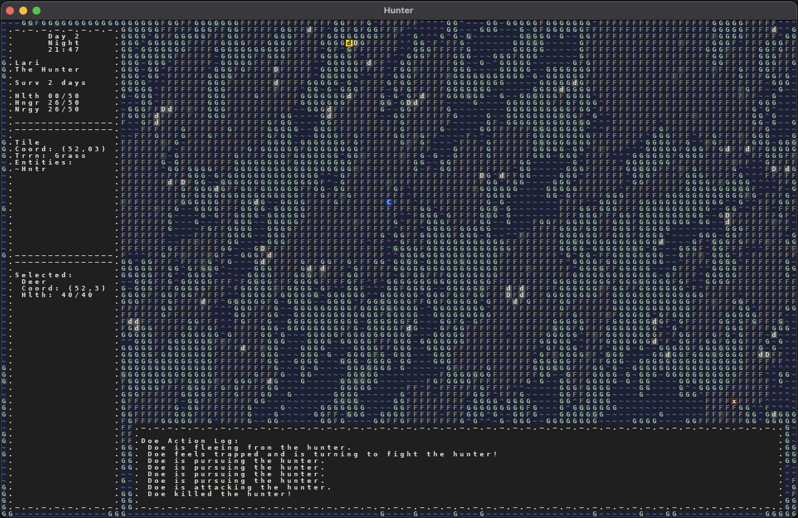
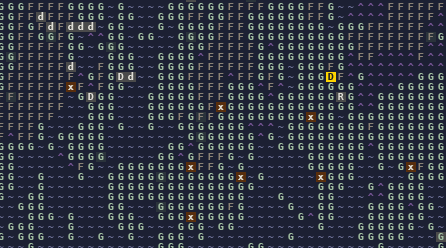

# May 22 2021
## Version 1.2 Complete
I've now completed v1.2, which primarily included the addition of deer (tier 1) and the improvement of wolves to tier 2. There turned out to be a decent number of challenges in this version, entirely relating to the AI systems that I have in place. I've always had the goal of adding layers of complex behavior to the creatures inhabiting this world, and in this version the systems I'd created so far, and my conceptualization of how to enable complex behaviors, were really put to the test.

### Action Cooldowns
When I first implemented the AI and action system in this game, I landed on having each entity have it's own queue of events/actions that it adds to and performs over time. So a rabbit with an empty queue would check if it's hungry, then check if it's tired, and add an appropriate action to its own queue. Each action added to the queue would have a timestamp in the future that indicated when it should be performed, and when the internal game time reaches that timestamp, the action is removed from the queue and performed. 

In this early implementation, I set the interval to be a static amount of time. Different entity types may have different interval times (e.g. rabbit vs hunter), but each entity type would have a consistent time interval between each action. And that was true no matter what type of action was perfomed. Whether the hunter was firing the bow at a rabbit, picking a berry off of a bush, or walking one tile, they all took the same amount of time.

Shortly after implementing this system, however, I realized that I also needed a way to have the state of certain entities change slowly over time. For example, bushes needed to periodically regrow berries, the hunter needed to slowly get more hungry and more tired, etc. So at the time, I decided to tack these periodic state changes onto the action system I had already implmented. So each time the hunter performed an action, I would also decrease their hunger and energy by a small amount. And because an entity type's action interval was consistent, this actually worked fine for a long time.

However, I have since added more entity types (wolves and deer) as well as several more complex behaviors such pursue and flee. And in particular, pursue and flee highlight a significant limitation of this initial implementation. If all actions occur at the same interval for an entity, then they can never move faster than whatever that interval dictates. So "pursuing" is just walking after a target and "fleeing" is just walking away from a threat. Obviously this isn't very functional and also isn't very interesting, so I knew that I needed to add action cooldowns.

Instead of having a consistent interval between all actions, I modified the action queue system to, when it finishes performing an action, schedule the next action after n amount of time, where n is the cooldown for the action that was just performed. That way, grazing on grass can take longer than fleeing from a threat, and so on.

This worked really well except for one issue: I was still modifying hunger and energy on every action, so now that certain actions could be performed much faster than others, performing those actions would result in hunger/energy being reduced much faster than before. And while in certain scenarios (such as with the hunter running vs walking) this may make sense, I felt that this tight coupling would not serve me well going forward.

The solution was simple: add a new queue, the entropy queue, in addition to the action queue. So now all intelligent entities had two queues. Steady entity "progression" (hunger/energy reduction, berries regrowing) was handled by the entropy queue, and actions were of course handled by the action queue.

I've used this quite extensively with deer, wolves, and the hunter so far, and it's working great.

Wew.

### Deer Tier 1 - These deer are MEAN
I added two types of deer: does and bucks. Each buck has 1 to 5 does that follow it. Whenever he gets too far away, they pursue him. This was easy enough to implement since I already had a pursuit action for wolves and the hunter.

The trickier part was enabling the deer to flee when a wolf or the hunter approaches. My first challenge was to select a good destination to flee to, and it seemed to me like a good idea to simply pick a random location in the opposite direction as the threat the deer is running from.

Given two points, A and B, on a 2D grid, it's relatively simple to calculate the point C, where C is in the opposite direction for both X and Y.

Let's say:
A (Deer): (1, 1)
B (Wolf): (3, 2)

Given this, the ideal destination for fleeing would be:
C: (-1, 0)

Relative to the deer, the Wolf is at +2 for X and +1 for Y, which means that the ideal flee destination would be the deer's X minus 2 and the deer's Y mins 1, which is (-1, 0).

Often times, though, the selected destination won't be pathable, so I made it retry a few times, and added jitter so that it would try a larger and larger radius around the inital destination.

If the deer tries a few times and fails to find a pathable destination to flee to, it will "feel cornered" and turn to attack whatever is pursuing it. This feels like a somewhat natural way to solve the technical issue of not wanting to do a thorough but costly search for a pathable destination.

 

Above, you can see that one of the does got "spicy" and attacked the hunter, which happened to result in the hunter's death. I thought this was pretty funny, so I took a screenshot. I never even considered the fact that the deer may attack and kill the hunter. It was not my intention for that to happen at all, but that's exactly the kind of interesting emergent behavior I hope to see more of as I add more creatures and layer in more complex behaviors.

Another somewhat interesting anomaly occured when I cranked up the wolf and deer spawn rate. Since deer spawn in groups, they ended up vastly outnumbering wolves. In addition, though deer don't fight consistently and aggressively like wolves, I gave the bucks a behavior where the more of their does that have been attacked recently, the more likely the buck is to get enraged and attack the threat. The combination of this buck aggression and deer greatly outnumber wolves resulted in a few quite grisely wolve massacres, such as the one below:

 

The little brown x's are all dead wolves, all of whom were killed by deer! These deer are MEAN. Currently wolves have a pretty hard time killing a deer since the wolves don't work together. However, it is possible. And in the near, future, I will improve wolf behavior so that they are more competetive. In the mean time, the still straight up wreck rabbits. :)

I've already written extensively about deer fleeing and movement, so check out my previous blog post if you're interested in that.

### Wolf Tier 2
I also increased wolves to tier 2, so they now simulate hunger, energy, and require sleep. When there is an abundance of rabbits on the map, wolves survive quite easily. However without rabbit or deer reproduction, the map will eventually run out of things that wolves can eat, which is a problem. Wolves not really in meta this patch. :p

### Future
I haven't planned out the next version too much yet, but I will say that the map, at 120x75, is feeling very cramped, especially with the addition of herds of deer. I think the next step is to increase the size of the map and enable scrolling! This will give wolves and deer a lot more room to coexist, and will allow for more realistic spawn rates.

I also learned about something called Perlin noise, which I would like to use to completely overhaul the map procedural generation, which is an absolute nightmare right now, and requires ruby to run.

I'll right a blog post soon about exactly what I want to get done in the next version.

Welp, see you later.