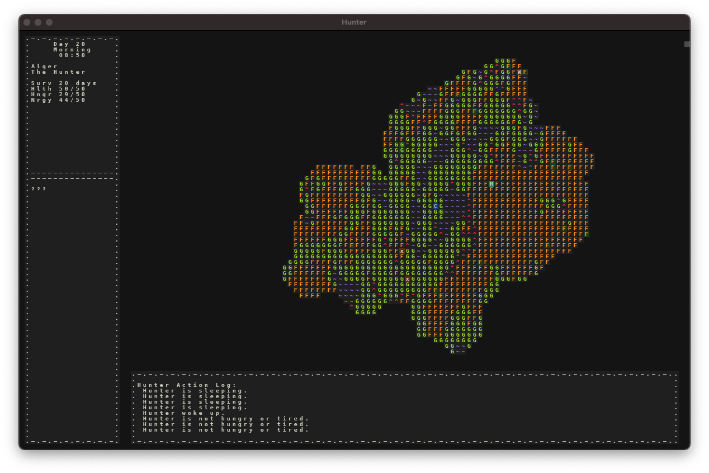

# March 6 2021
## Proof of Concept v1.0
It is with great rejoicing that I announce that POC v1.0 is now released! The main goal of this version was to add wolves and tweak the game balance.

Below you can see that the Hunter and Camp icons have new colors, green and blue, and the brown X's are actually dead wolves that the hunter killed! And there is one living wolve in the very top right, the brown W.

 

The wolf simulation is currently quite simple. It is able to pursue, kill, and eat rabbits, pursue and fight the hunter, and wander. And the hunter is able to fight back and kill the wolves if necessary. Wolves have no hunger or energy stats, and they never sleep.

While the wolf behavior is incredibly simple and not at all realistic, I'm quite happy with what it adds to v1.0 of the game. The provide a very real threat to the hunter. If the hunter encounters two wolves at once, it's almost certain death. But 1v1, the hunter always prevails unless they have low health to begin with.

One consequence of battles with wolves was that the hunter was often at very low health for quite a long time. The only way of healing is sleeping, and healing is quite slow in this way, so I decided to give the Hunter the ability to bandage when their health is low. One interesting issue, however, is that this meant the hunter could 'bandage' any damage that was sustained due to starvation/low hunger. This, of course, was not intended, so I put a special case in such that if the hunter has the status effect 'Starvation', then they are unable to bandage. This doesn't exactly make sense, either, but I think it's better than the alternative. I'll have to enhance this system and behavior at a later date.

When testing wolf behavior, I set the wolf spawn rate pretty high so that I could make lots of observations. I was testing this in the evening one day, and I accidentally left the simulation running all night. When I noticed in the morning, the wolves had hunted down and killed *every* rabbit on the map. And since rabbits don't reproduce and I don't have any respawn mechanism implemented for entities, there was no way for more rabbits to enter the map. They were officially extinct.

This was pretty amusing, and was a very small taste of the sort of emergent behavior that I hope will arise from the simulation when it's more mature.

So now that I'm at v1.0, the question, of course, is 'What comes next?' While I am itching to improve the simulation itself, improve the ecosystem, add more ecosystems, add more creatures, and improve hunter behavior, I think for v1.1 I'll focus instead on improving the 'playability' of the simulation. There are a number of medium and small tasks that I think I can do to make watching the simulation unfold much more interesting, and allow for some amount of interactivity.

For example, being able to select an entity and view the stats of it would be nice. I could also maintain an action log for all entities, and display just the action log for the selected entity.

I'd also like to tackle some technical issues that I feel need to be solved sooner rather than later. For example, right now every single action for all entities takes the same amount of time. This, of course, won't allow for a very good simulation in the long run, so I'd like to change the event and action system to allow for different actions to have different cooldowns.

I'm going to spend some more time planning out the next version, and I'll create another blog post when I have a clearer plan.

Welp, see you later.